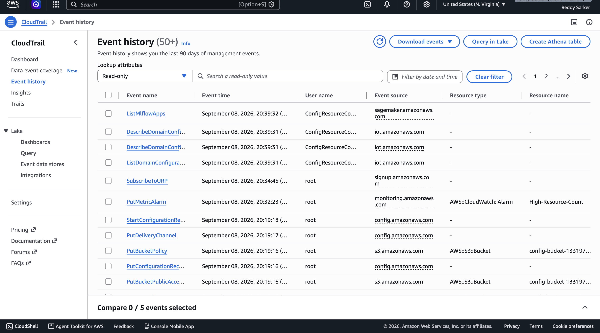
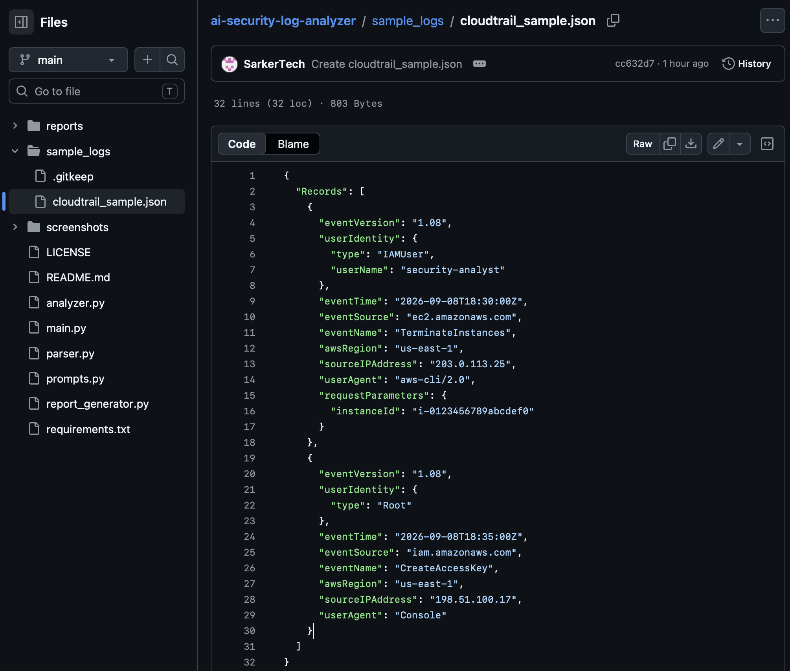
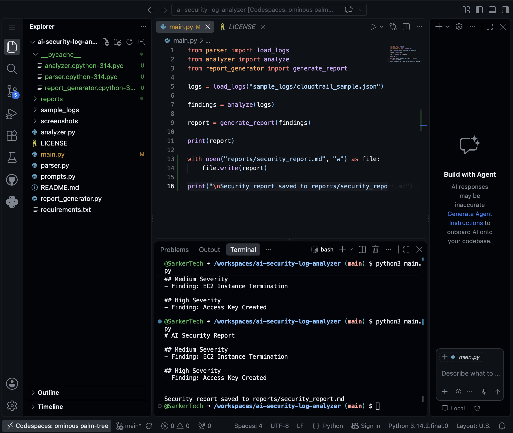
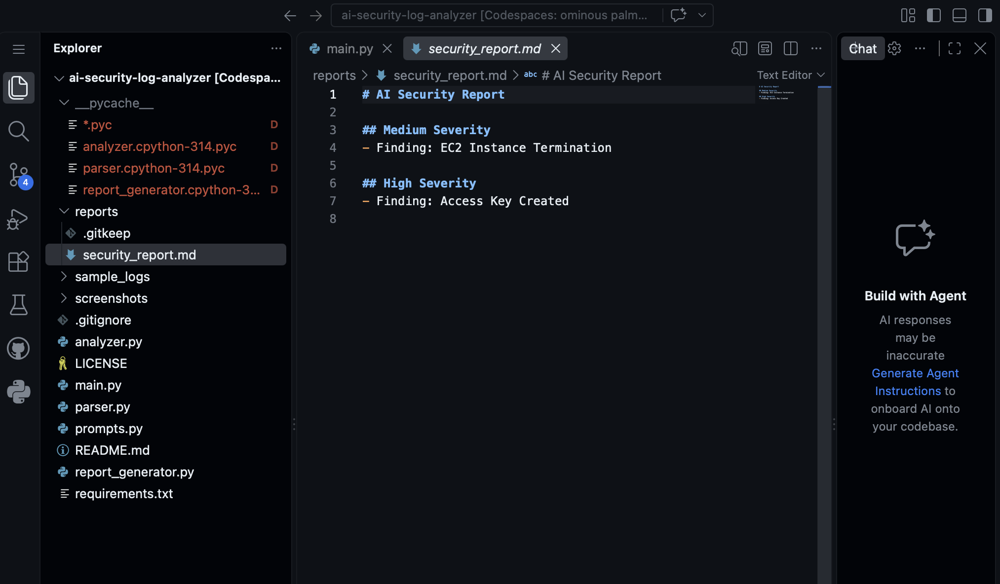

# AI Security Log Analyzer

AI-powered security log analyzer for AWS CloudTrail logs using Python, MITRE ATT&CK mapping, and automated security reporting.

---

## Overview

This project demonstrates how CloudTrail logs can be analyzed to identify suspicious cloud activity using Python. It simulates a lightweight cloud security monitoring solution capable of detecting high-risk events and generating security findings.

The project is designed to showcase cloud security, AWS logging, Python automation, and AI-assisted security analysis.

---

## Objectives

- Analyze AWS CloudTrail logs
- Detect suspicious cloud activities
- Identify high-risk IAM events
- Generate security reports
- Demonstrate security automation using Python
- Prepare for AI-powered log analysis

---

## Technologies Used

- Python 3
- Amazon Web Services (AWS)
- AWS CloudTrail
- Git
- GitHub
- MITRE ATT&CK Framework
- OpenAI API (planned)

---

## Project Structure

```text
ai-security-log-analyzer/
│
├── sample_logs/
│   └── cloudtrail_sample.json
│
├── reports/
│
├── screenshots/
│
├── analyzer.py
├── parser.py
├── prompts.py
├── report_generator.py
├── main.py
├── requirements.txt
└── README.md
```

---

## Features

- Parse AWS CloudTrail logs
- Detect suspicious IAM activities
- Identify high-risk events
- Generate Markdown security reports
- Modular Python architecture
- Ready for AI integration

---

## Detection Rules

Current detections include:

- CreateAccessKey
- TerminateInstances

Additional detections will be added as the project evolves.

---

## Example Output

```text
# AI Security Report

## High Severity
- Finding: Access Key Created

## Medium Severity
- Finding: EC2 Instance Termination
```

---

## Project Screenshots

### CloudTrail Event History


### Sample CloudTrail JSON Log


### Python Analyzer


### Generated Security Report


## Skills Demonstrated

- AWS Cloud Security
- CloudTrail Log Analysis
- Python Programming
- Security Automation
- Threat Detection
- Security Reporting
- MITRE ATT&CK
- Git & GitHub

---

## Future Improvements

- AI-powered security analysis
- MITRE ATT&CK mapping
- Risk scoring
- HTML/PDF report generation
- Additional AWS detection rules
- Support for GuardDuty findings

---

## Author

**Redoy Sarker**

Cybersecurity • Cloud Security • Python • AWS
